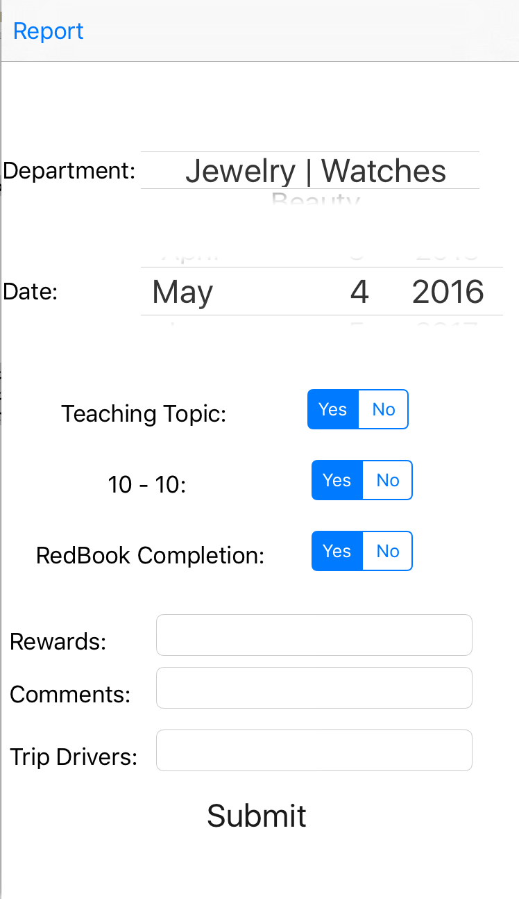
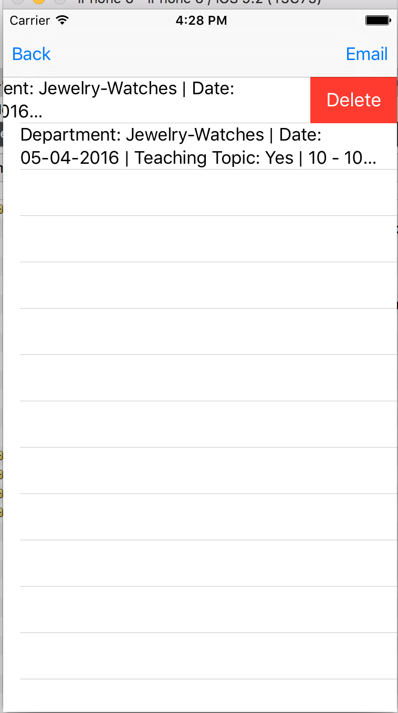

# Stephs Stuff
The goal of this project was to learn more about the basics of Swift and deomonstrate my knowledge about the language. I was asked to create an application by the store manager of Nordstrom (Her name is Stephanie hence the name of the app) to help keep her meetings and events organized throughout the day. She gave me a list of topics she wanted to keep track of and also to be able to email herself the information. 

  

## Screen Shots of App

